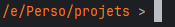
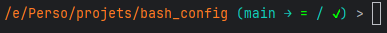
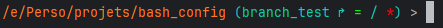

# My custom config for console prompt (Linux & Git For Windows)
Feel free to use if you want

Colors based on "Outer Wilds" and its DLC "Echoes Of The Eye"

## Installation script

### ⚠ Preexisting file will be overwritten ⚠
### Make sure to create a backup if you want to keep your actual .bashrc for later uses
The installation script is available in the "Releases" section

## Display changes

Base prompt:

With a git repo (main branch):

With a git repo (other branch):

## Aliases

- stat = git status
- log = git log
- push = git push
- fpush <branch_name> = git push -u origin <branch_name>
- pull = git pull
- commit "<commit_message>" = git commit -m "<commit_message>"